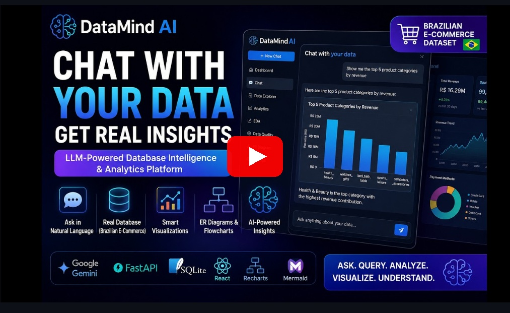
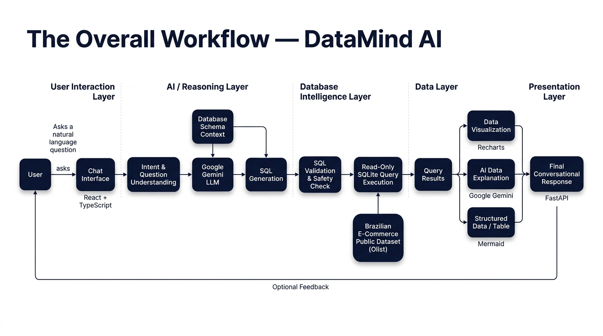
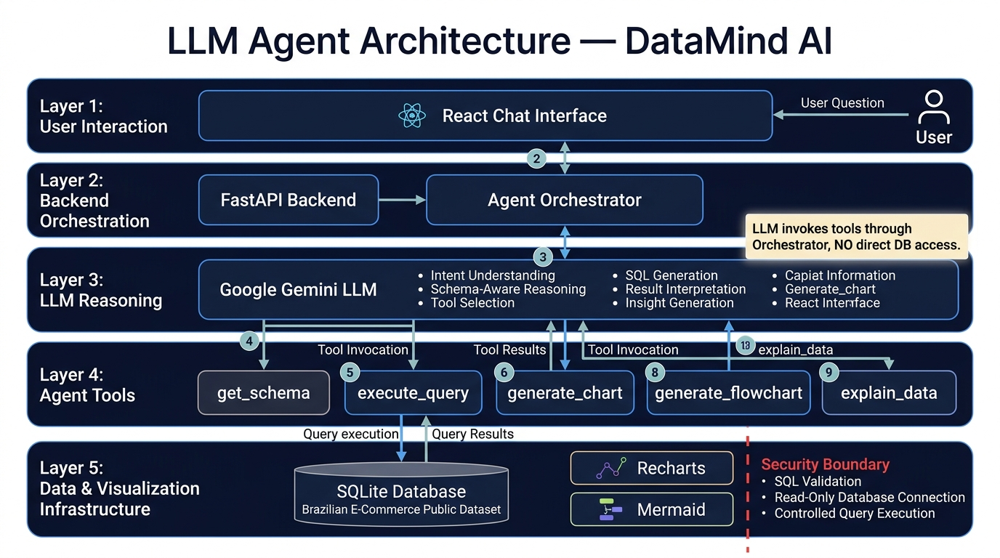
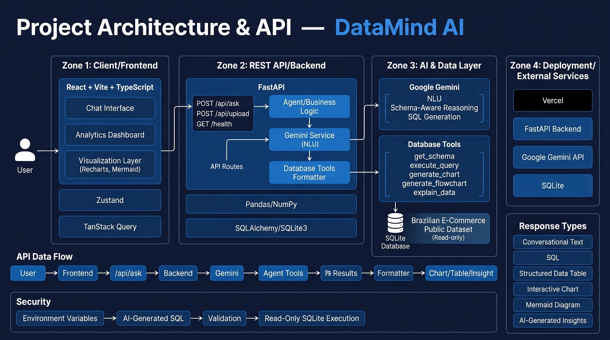

# DataMind AI

**LLM-Powered Conversational Database Intelligence & Analytics Platform**

DataMind AI is an intelligent conversational data analytics platform that enables users to interact with a real-world e-commerce database using natural language instead of manually writing SQL queries.

The platform combines Google Gemini, FastAPI, SQLite, React, Recharts, Mermaid, and an interactive analytics dashboard to transform natural-language questions into database queries, retrieve actual data, generate meaningful visualizations, and provide understandable insights.

DataMind AI is built around the Brazilian E-Commerce Public Dataset (Olist), a real-world Brazilian e-commerce dataset publicly available through Kaggle.

**Live Demo:** [https://data-mind-ai-eken.vercel.app/](https://data-mind-ai-eken.vercel.app/).

**Project Demo Video:**

[](https://youtu.be/Qu4EPjvnV_E "Click to watch DataMind AI Prototype Demonstration on YouTube")

---

## About the Project

Traditional database analysis requires users to understand SQL, database schemas, table relationships, and data visualization techniques. This creates a barrier for users who need insights from data but do not have extensive technical knowledge.

DataMind AI addresses this problem through a conversational AI interface combined with a comprehensive analytics dashboard. Users can ask questions such as:

* What are the top 5 product categories by revenue?
* Show me the monthly revenue trend.
* Which customers have placed the most orders?
* Which payment method is most commonly used?
* Which states generate the highest revenue?
* Draw the ER diagram for this database.

The system understands the user's request, uses the available database schema, generates an appropriate SQL query, executes the query through a secure read-only database layer, presents the results through suitable visualizations, and provides natural-language insights.

### The Overall Workflow

``

---

## Dataset

### Brazilian E-Commerce Public Dataset

DataMind AI uses the Brazilian E-Commerce Public Dataset by Olist, a real-world e-commerce dataset publicly available through Kaggle. The dataset contains interconnected information related to Brazilian online commerce, including:

* Customers
* Orders
* Order items
* Products
* Sellers
* Payments
* Reviews
* Product categories
* Customer locations
* Seller locations
* Delivery information
* Product dimensions
* Product weight
* Freight values

The dataset is loaded into a SQLite database and serves as the primary source for the application's analytical queries and dashboard visualizations.

### Data-Driven Principle

DataMind AI follows a simple principle:

```text
User Question -> Database Query -> Actual Dataset Records -> Result -> Visualization + Explanation
```

All analytical visualizations and metrics are computed from the actual records contained in the Brazilian E-Commerce Public Dataset loaded into the application's SQLite database.

### Dataset-Focused Conversational AI

DataMind AI is intentionally designed to answer questions related to the available e-commerce dataset. Examples include:

* How many orders were delivered?
* What are the top product categories by revenue?
* Which payment method is most commonly used?
* What is the average delivery time?
* Which states generate the highest revenue?
* Which categories have the highest review scores?
* Show me the monthly revenue trend.
* Which sellers have the highest sales?
* What is the average order value?
* Which products have the highest freight cost?

The AI uses the database schema and executes queries against the actual stored dataset to retrieve relevant information.

### Dataset Boundary

DataMind AI is not intended to be a general-purpose ChatGPT system. Its primary purpose is to provide reliable answers based on the connected Brazilian E-Commerce Public Dataset.

For example, general questions such as "Tell me a joke", "What is the capital of France?", or "Explain quantum physics" are outside the intended database-analysis scope. The system is designed to focus on the information available in the connected dataset rather than inventing unrelated business information.

This dataset-grounded approach helps maintain a clear boundary between:

```text
Available Database Information -> DataMind AI -> Data-Driven Answer
```

---

## Key Features

### 1. Conversational Database Interaction
Users can interact with the database using natural language without manually writing SQL queries. The conversational interface supports analytical questions and follow-up questions within the session.

### 2. Natural Language to SQL
Google Gemini interprets natural-language questions and generates SQL queries based on the actual database schema.

**Example:**
* User: Show the top 5 product categories by revenue.
* Gemini: Understands the question and database schema.
* SQL: Generated according to the available tables and columns.
* SQLite: Executes the validated read-only query.
* DataMind AI: Displays the result, visualization, and explanation.

### 3. Database Schema Understanding
The backend provides the AI layer with information about the database structure, including:
* Table names
* Column names
* Data types
* Relationships
* Available fields

### 4. Secure Read-Only SQL Execution & Safe Database Interaction
AI-generated SQL is executed through a controlled database layer. The SQLite database is accessed in read-only mode to reduce the risk of destructive operations.

#### Safe Database Interaction
Since AI-generated queries interact with databases, DataMind AI includes basic safety mechanisms. The system is designed to prioritize read-only database operations and prevent destructive commands such as:
* `DROP`
* `DELETE`
* `UPDATE`
* `INSERT`
* `ALTER`
* `TRUNCATE`

This reduces the risk of accidental changes to the database.

### 5. Dynamic Data Visualization
DataMind AI dynamically presents analytical results through interactive visualizations. Powered by Recharts and Mermaid, the supported chart types include:
* **Bar Charts** (Vertical bar charts for rank and metric comparisons)
* **Horizontal Bar Charts (`hbar`)** (Optimized for category rankings)
* **Line Charts** (Time-series analysis and revenue trends)
* **Pie Charts** (Categorical share breakdown)
* **Donut Charts** (Distribution and proportion visualization)
* **Scatter Plots** (Correlation and multi-variable comparison)
* **ER Diagrams & Flowcharts** (Database entity-relationship mapping via Mermaid)

### 6. AI-Powered Data Insights
DataMind AI does not simply return raw numbers. The platform can analyze query results and provide human-readable insights explaining important trends, comparisons, patterns, dominant categories, performance indicators, and business observations.

### 7. ER Diagram Generation
The platform can analyze the database structure and generate visual representations of relationships between entities using Mermaid. This allows users to understand complex database structures without manually inspecting every table.

### 8. Interactive Data Explorer
Users can directly inspect the underlying database records through interactive tables. Supported capabilities include pagination, sorting, filtering, multi-table viewing, and structured data inspection.

### 9. Comprehensive Analytics Dashboard
DataMind AI provides a dedicated analytics dashboard containing multiple sections for exploring the Brazilian E-Commerce Public Dataset. Dashboard sections include Overview, Orders, Revenue, Products, Customers, Data Explorer, EDA, and Data Quality.

> **Note on Repository Architecture & GitHub Language Statistics:**  
> DataMind AI is natively developed as a **TypeScript + React** frontend and a **Python + FastAPI** backend. Standalone HTML dashboard exports previously included for presentation demos have been excluded from tracking so that GitHub Linguist accurately reflects the actual TypeScript and Python source code.

---

## Analytics Dashboard

### 1. Overview (`/dashboard`)
The Overview dashboard provides a high-level summary of business performance.
* **KPI Cards**: Displays important metrics such as Total Orders, Total Revenue, Total Customers, Average Order Value, Delivery Rate, Total Products, Total Sellers, and Average Review Score.
* **Monthly Revenue Trend**: An interactive area chart displays month-over-month revenue trends to help users identify revenue growth, decline, and seasonal patterns.
* **Order Volume & Status**: Visualizations showing order volume and order-status distribution (Delivered, Shipped, Canceled, etc.).
* **AI Key Insights**: A dedicated AI-generated insights section analyzes the available business trends and provides natural-language observations.
* **Ask AI**: A direct entry point allows users to move from dashboard analytics to conversational data exploration.

### 2. Orders Analytics (`/dashboard/orders`)
The Orders dashboard focuses on order timing, delivery performance, and logistics.
* **Order Timing Analytics**: Analyzes order volume according to day of the week and hour of the day.
* **Delivery Performance**: Compares actual delivery time vs. estimated delivery time to identify potential logistical bottlenecks.
* **Logistics KPIs**: Metrics include shipping information, freight values, and delivery success.

### 3. Revenue Analytics (`/dashboard/revenue`)
The Revenue dashboard focuses on financial performance and payment analytics.
* **Payment Methods**: Visualizations for payment distribution (Credit Card, Boleto, Voucher, Debit Card).
* **Installment Analytics**: Analyzes customer installment behavior and payment patterns.
* **Geographic Revenue**: Revenue explored geographically by State or City.

### 4. Products Analytics (`/dashboard/products`)
The Products dashboard focuses on product and category performance.
* **Top Categories**: Horizontal bar charts display the highest-performing product categories.
* **Category Volume vs Value**: Compares product volume versus revenue generated.
* **Product Dimensions and Weight**: Analyzes physical characteristics against freight value and sales.

### 5. Customer Analytics (`/dashboard/customers`)
The Customers dashboard provides customer-level and geographic analysis.
* **Geographic Distribution**: Customer distribution by State and City.
* **Customer Lifetime Value**: Estimates customer value where supported by the dataset.
* **Review Analysis**: Correlates review scores with product categories, sellers, and customer behavior.

### 6. Data Explorer (`/dashboard/explorer`)
Provides direct access to the underlying database records (orders, customers, products, payments, sellers, reviews, order_items). Offers pagination, sorting, filtering, and structured data inspection.

### 7. Exploratory Data Analysis (`/dashboard/eda`)
Provides statistical analysis of the dataset.
* **Correlation Matrices**: Investigates relationships between variables (Price, Freight Value, Review Score, etc.).
* **Distribution Histograms**: Visualizes the distribution of order values, prices, freight values, etc.
* **Outlier Detection**: Helps identify unusual values and potential anomalies within numerical data.

### 8. Data Quality (`/dashboard/quality`)
Provides information about dataset integrity and health.
* **Null Value Tracking**: Identifies missing values across important columns.
* **Data Freshness**: Displays information about the latest available records.
* **Schema Validation**: Checks whether the dataset follows the expected schema and data types before AI processing.

---

## Visualization Engine

DataMind AI uses Recharts and Mermaid as its visualization engines. Supported visualization types include:
* **Bar Charts**: Vertical bar plots for comparing numeric values across discrete categories.
* **Horizontal Bar Charts (`hbar`)**: Optimized for ranking top categories and long label displays.
* **Line Charts**: Time-series plots for tracking metric changes over time.
* **Pie Charts**: Proportional distribution of categorical metrics.
* **Donut Charts**: Ring distribution plots for status and category share.
* **Scatter Plots**: Multi-variable correlation plots.
* **ER Diagrams / Flowcharts**: Visual database relationship mapping powered by Mermaid.

**Visualization Features:**
* **Responsive Charts**: Automatically adapt to different screen sizes.
* **Custom Tooltips**: Interactive tooltips for inspecting individual data values.
* **Hover Effects**: Interactive hover behavior improves readability.
* **Fullscreen Expansion**: Charts can be expanded for detailed analysis and presentations.
* **Intelligent X-Axis Handling**: Includes X-axis label deduplication logic to reduce overlapping labels for larger datasets.

---

## LLM Agent Architecture

DataMind AI follows an LLM-powered architecture that connects natural-language interaction with database operations and visualization.

``

### Agent Tools
* **get_schema**: Retrieves the database schema including tables, columns, data types, and relationships.
* **execute_query**: Executes validated SQL queries against the SQLite database in a controlled, read-only mode.
* **generate_chart**: Generates visual representations from structured query results.
* **generate_flowchart**: Generates database and process visualizations using Mermaid (ER diagrams, process flows).
* **explain_data**: Analyzes query results and produces natural-language explanations and insights.

### Example AI Workflow
For a question such as: "Show me the top 5 product categories by revenue."
1. Receive the user's question
2. Understand the user's intent
3. Inspect the database schema
4. Generate SQL
5. Validate the SQL
6. Execute the query
7. Retrieve actual dataset results
8. Generate a suitable visualization
9. Analyze the results
10. Return the final conversational response (Query Result + Interactive Visualization + Data Table + AI-Generated Insight)

---

## Dashboard and AI Integration

DataMind AI provides two complementary ways to interact with the same underlying dataset:

* **Conversational Analytics**: Users ask natural-language questions and the AI retrieves relevant data and explains the result.
* **Visual Analytics**: Users can directly explore predefined dashboards (Overview, Orders, Revenue, Products, Customers, Data Explorer, EDA, Data Quality).

This creates a unified analytical experience driving from real-world data directly to data-driven insights.

---

## Technology Stack

### Frontend
* React 19
* TypeScript
* Vite
* Tailwind CSS
* TanStack Router
* TanStack Query
* Zustand
* Recharts
* Mermaid
* Framer Motion
* Radix UI
* Lucide React
* React Markdown

### Backend
* Python
* FastAPI
* Uvicorn
* Pandas
* NumPy
* SQLAlchemy
* SQLite3
* Python-dotenv

### Artificial Intelligence
* Google Gemini
* Google GenAI SDK
* Natural Language Understanding
* Natural Language to SQL
* AI-assisted Data Analysis
* AI-generated Insights

### Database
* SQLite
* Brazilian E-Commerce Public Dataset (Olist)

### Deployment
* Vercel (FastAPI backend deployment & Frontend routing)
* SQLite database

---

## Project Architecture & API

``

**API Architecture**
* `POST /api/ask`: Main conversational endpoint handling NLP, Schema Context, SQL Generation, Validation, and Execution.
* `POST /api/upload`: Handles dataset uploads and processing.
* `GET /health`: Provides backend health and connectivity information.

---

## Security

DataMind AI treats AI-generated SQL as untrusted input. The database layer provides controlled query execution and read-only database access to reduce the risk of destructive database operations. 

Sensitive credentials are stored using environment variables rather than directly inside the source code. Actual API keys must never be committed to GitHub.

---

## Data Reliability Principle

DataMind AI follows a dataset-grounded approach to analytical responses. If there is no relevant dataset information, there is no data-driven answer. The platform is designed to ground analytical responses in the information available in the connected database.

All analytical visualizations and metrics are computed from the actual records contained in the Brazilian E-Commerce Public Dataset loaded into the application's SQLite database, providing transparency from Dataset to Database to SQL Query to Result to Visualization to AI Explanation.

---

## Getting Started

### Prerequisites
* Node.js
* Python 3.x
* Git
* Google Gemini API Key

### Clone the Repository
```bash
git clone <YOUR_GITHUB_REPOSITORY_URL>
cd DataMind_AI
```

### Frontend Setup
```bash
npm install
```
Create the frontend environment configuration:
```env
VITE_API_BASE_URL=<YOUR_BACKEND_URL>
```
Start the frontend:
```bash
npm run dev
```

### Backend Setup
Create a Python virtual environment:
```bash
python -m venv venv
```
Windows:
```bash
venv\Scripts\activate
```
Install dependencies:
```bash
pip install -r backend/requirements.txt
```
Configure the Gemini API key:
```env
GEMINI_API_KEY=<YOUR_GEMINI_API_KEY>
```
Start the FastAPI server:
```bash
uvicorn backend.main:app --reload
```

---

## Hackathon Context

* **Event**: iTech AI Innovation Hackathon 2026
* **Challenge**: Building Intelligent LLM Agents for Database Interaction & Visualization
* **Institution**: Sri Sairam Engineering College
* **Team Name**: SwiftTech

### Problem Statement Alignment

| Hackathon Requirement | DataMind AI Implementation |
|---|---|
| Chat Interface | React-based conversational UI |
| Natural Language Understanding | Google Gemini |
| Database Integration | SQLite |
| Schema Discovery | Database schema contextualization |
| SQL Query Execution | Secure read-only SQL execution |
| Dynamic Visualization | Recharts (Bar, Line, Pie, Scatter) |
| ER Diagram | Mermaid |
| Process Visualization | Mermaid-based visualization |
| Data Explanation | AI-generated insights |
| Multi-turn Conversation | Persistent conversational state |
| Error Handling | Backend and query error handling |
| SQL Transparency | Generated SQL can be displayed |
| Analytics Dashboard | Multiple dedicated dashboard modules |
| Data Explorer | Interactive database tables |
| Exploratory Data Analysis | Correlation, distributions, outliers |
| Data Quality | Null values, freshness, schema validation |

---

## Future Enhancements
* Multi-database connectivity (PostgreSQL and MySQL support)
* Advanced LLM agent orchestration
* Custom dashboard builder
* Collaborative visualization sharing
* Advanced anomaly detection
* Automated insight generation
* Role-based access control
* Real-time streaming responses

---

## Team

**SwiftTech**

| No. | Student Name | Student ID | Department | Year |
|---|---|---|---|---|
| 1 | KISHORE S | SEC24IT035 | Information Technology | 3rd Year |
| 2 | DIVYASREE D | SEC24IT061 | Information Technology | 3rd Year |
| 3 | SIVAPERUMAL D | SEC24IT055 | Information Technology | 3rd Year |
| 4 | DHARSHINI S | SEC24IT033 | Information Technology | 3rd Year |

---

## Project Vision

DataMind AI aims to make database intelligence accessible through natural conversation. The vision is to allow users to move from "How do I write this SQL query?" to "Ask the data."

By combining an LLM-powered conversational interface, secure database querying, interactive analytics, statistical exploration, and visual storytelling, DataMind AI provides a unified platform for understanding real-world e-commerce data.

**Developed as part of the iTech AI Innovation Hackathon 2026 at Sri Sairam Engineering College.**

*DataMind AI: Ask. Query. Analyze. Visualize. Understand.*
